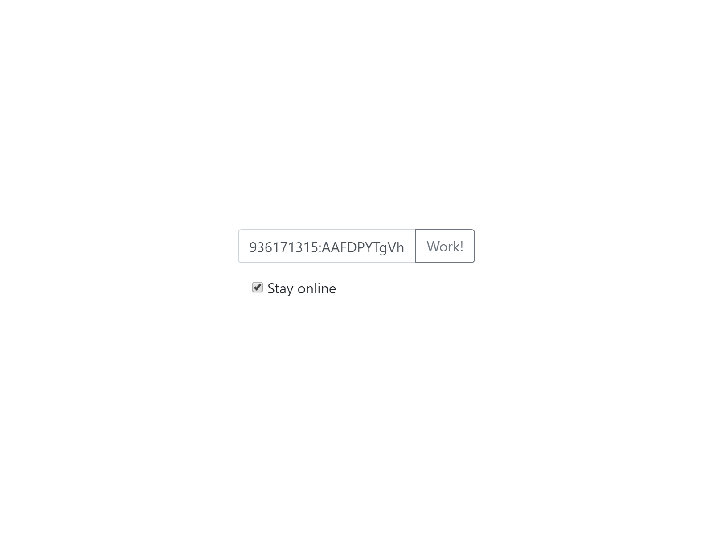
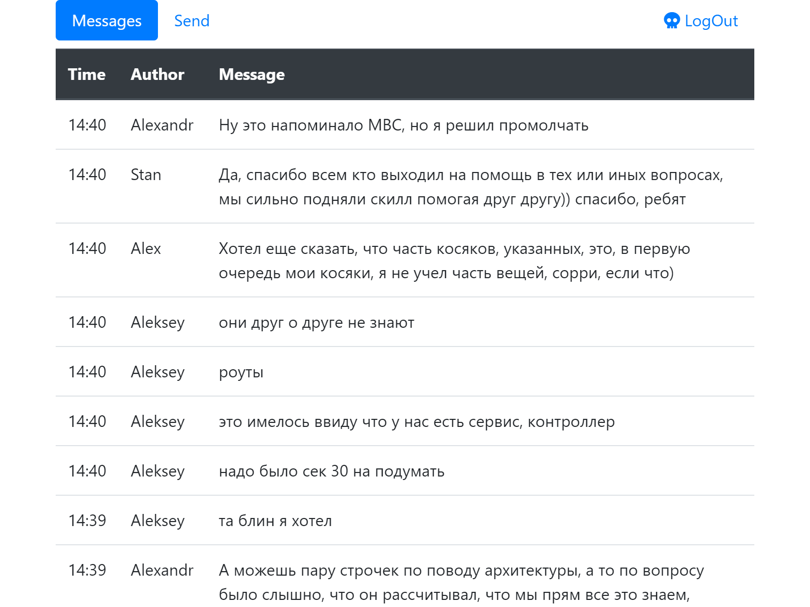
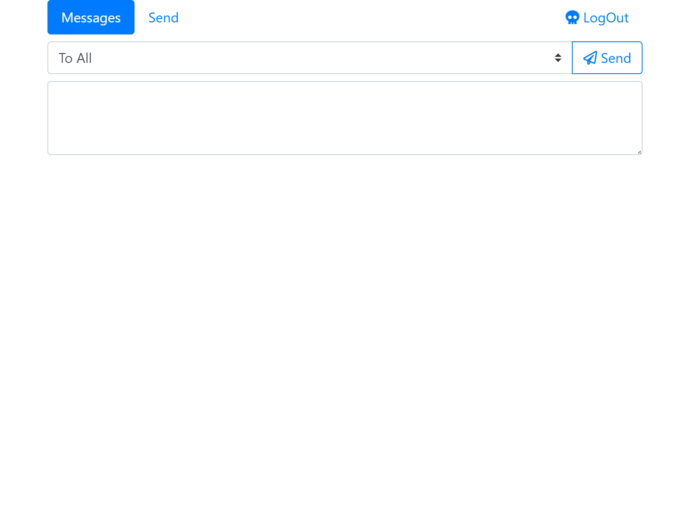

# TELESOFA
__[LINK](https://so2niko.github.io/telesofa/)__
Free service for working with your telegram bot.
You need only Telegram Bot API token.

__How to use:__

##### Authorization
_Paste bot API Token_

##### Messages
_List of last messages for 2 days_ 
_(because we do not use any DB. All site is working in your browser)_

##### Page with send message window
_Select receivers, type text and send it_

__Enjoy:)__